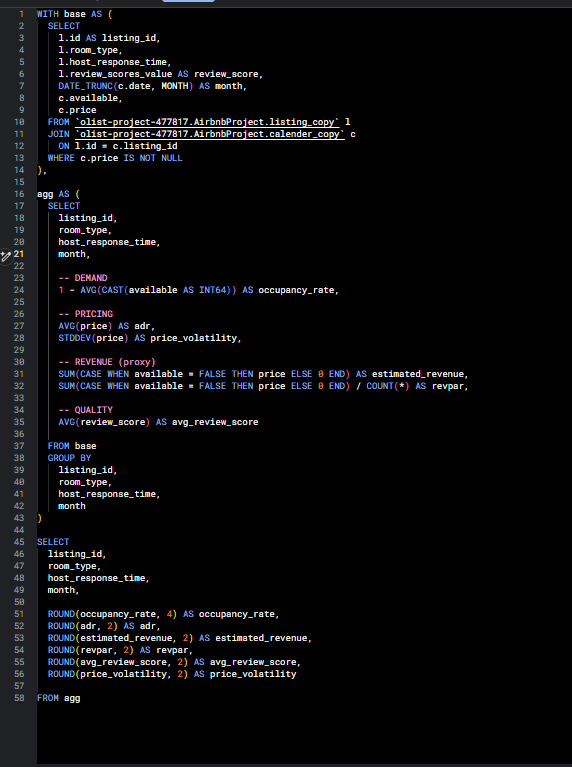

# Airbnb Listings – Performance KPI Dashboard

Bu proje, Airbnb ilanlarının performansını **talep**, **fiyatlandırma verimliliği** ve **gelir performansı** ekseninde analiz eden uçtan uca bir veri analizi çalışmasıdır.  
Çalışmada ham Airbnb verileri, **Google BigQuery (SQL)** kullanılarak modellenmiş ve **Looker Studio** üzerinden tek sayfalık, yönetici seviyesinde bir dashboard ile görselleştirilmiştir.

Projenin temel amacı; günlük seviyedeki karmaşık verileri anlamlı KPI’lara dönüştürerek, **karar destekleyici ve okunabilir bir analiz çıktısı** üretmektir.

---

## 📌 Proje Özeti

- **Veri Kaynağı:** Airbnb listing ve calendar verileri  
- **Kullanılan Araçlar:**  
  - Google BigQuery (SQL)  
  - Looker Studio (Dashboard & Görselleştirme)  
- **Veri Seviyesi (Granularity):** Aylık, ilan bazlı  
- **Çıktı:** Tek sayfalık performans KPI dashboard’u

---

## 🎯 Yanıtlanan İş Soruları

- Airbnb pazarında genel talep durumu nedir?
- Oda tiplerine göre doluluk oranları nasıl değişmektedir?
- Fiyatlandırma stratejileri gelir verimliliğini nasıl etkilemektedir?
- Ev sahibinin yanıt süresi gelir performansı üzerinde etkili midir?
- Zaman içinde (aylık) talep nasıl bir trend izlemektedir?

---

## 🧱 Veri Modeli ve Yaklaşım

Proje kapsamında iki ana tablo kullanılmıştır:

- **Listing Tablosu:**  
  - Oda tipi  
  - Ev sahibinin yanıt süresi  
  - Değerlendirme puanı  

- **Calendar Tablosu:**  
  - Günlük müsaitlik bilgisi  
  - Günlük fiyat verisi  

Bu tablolar BigQuery üzerinde birleştirilmiş ve aylık ilan seviyesinde toplulaştırılarak  
`mart_listing_kpi` isimli bir **mart-level KPI view** oluşturulmuştur.

Bu yaklaşım sayesinde:

- KPI tanımları standartlaştırılmıştır  
- Tek bir “single source of truth” sağlanmıştır  
- BI tarafında performanslı ve tutarlı bir yapı kurulmuştur  

---

## 📊 Hesaplanan Temel KPI’lar

- **Occupancy Rate (Doluluk Oranı)**  
- **ADR (Average Daily Rate)**  
- **Estimated Revenue (Tahmini Gelir – proxy)**  
- **RevPAR (Revenue per Available Room)**  
- **Average Review Score**  
- **Price Volatility (Fiyat Dalgalanması)**  

---

## 📈 Dashboard – Looker Studio

Dashboard, **az ama iş değeri yüksek KPI’lara** odaklanacak şekilde tasarlanmıştır.  
Amaç; bilgi kalabalığı yaratmadan, net içgörüler sunmaktır.

Dashboard’da yer alan ana görseller:

- Genel performans KPI scorecard’ları  
- Oda tipine göre doluluk oranı  
- Ev sahibinin yanıt süresine göre RevPAR analizi  
- Zaman içerisinde doluluk trendi (seasonality)

### 🖥️ Dashboard Görseli

---

## 🧮 SQL – KPI View (BigQuery)

Aşağıda, tüm KPI’ların üretildiği **mart-level SQL view** yer almaktadır.  
Bu view, Looker Studio tarafında doğrudan veri kaynağı olarak kullanılmıştır.

### 📄 SQL View Yapısı

---

## 🧠 Öne Çıkan İçgörüler

- Shared room’lar en yüksek doluluk oranına sahiptir, ancak bu durum her zaman en yüksek gelire karşılık gelmemektedir.
- Daha hızlı yanıt veren ev sahipleri, daha yüksek RevPAR üretmektedir.
- Yılın son aylarına doğru doluluk oranlarında düşüş gözlemlenmekte, bu da mevsimsellik etkisine işaret etmektedir.
- Gelir verimliliğini anlamak için yalnızca doluluk değil, **RevPAR gibi birleşik metrikler** kritik öneme sahiptir.

---

## 🚀 Sonuç

Bu proje, KPI’ların tek tek sorgularla üretilmesi yerine, merkezi bir veri modeli altında toplanmasının;
- veri tutarlılığı,
- dashboard performansı,
- okunabilirlik ve
- iş değeri

açısından ne kadar önemli olduğunu göstermektedir.

Proje, **Data Analyst / Business Intelligence** odaklı portföy çalışması olarak tasarlanmıştır.

---

## 📬 İletişim

Bu proje veya benzer çalışmalar hakkında geri bildirim almak memnuniyet vericidir.

**İlker Keleş**  
Data Analyst  
GitHub: https://github.com/ilkerkeless
